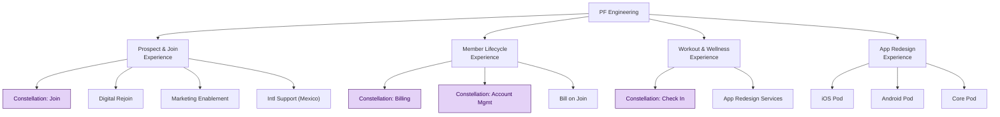

PF Engineering is organized into **four Experience Workstreams**, each aligned to a slice of the member journey and subdivided into **pods** — small cross-functional teams that own a specific outcome.[^topology]

One program cuts across the org: **Constellation Scale Readiness** runs as four pods in three different workstreams (Join, Billing, Account Mgmt, Check In) — highlighted below.

## Workstream leadership

| Workstream | Solution Lead | Tech Lead | Data Lead | Design Lead |
| --- | --- | --- | --- | --- |
| Prospect & Join | Michelle Cominos | Jeremiah Dow | Joey LaRocca | Jim Joyce |
| Member Lifecycle | Addy Hallowell | Dan Thibault | Colin Proser | Kim Boualavong |
| Workout & Wellness | Hallianna D'Andreti | Kayleigh Mitchell | Ajinth Christudas | Selina Taylor |
| App Redesign | Hallianna D'Andreti | Jamie Hagemeister | Aaron Slocum | Selina Taylor |

**Program Manager** across all four workstreams: Erin Wright. **App Redesign design** is supported by Chrissy Greco + Madeleine Kosheff. **Manual QA** is pooled per workstream rather than per pod:

- **Prospect & Join** — Yury Shpakovsky, Tatiana Bilevich, Daniil Deryabin, Denis Prakharchuk
- **Member Lifecycle** — Svetlana Kot, Alina Butrim, Ksenia Klyavets
- **Workout & Wellness** — Alena Zharina, Pavel Smelovsky
- **App Redesign** — Natalia Smolyarova, Zhanna Kabieva, Ksenia Klyavets, Ilona Khvastiyonok, Alexandra Tkachik

## Prospect & Join Experience

Serves prospects through the join flow. Workstream mobile: Pavlo Lukianets (Android); iOS TBD.

| Pod | Product & delivery | Engineering |
| --- | --- | --- |
| **Constellation: Join** | **PM** Michelle Cominos **Design** Jim Joyce **Scrum** Mercedes Blattner **Assoc. PM** Polina Bolonkina | **Tech lead** Dan Lourenço **Dev lead** Vlad Kondratenko Kostya Atashonok · Services Artem Slednev · Services Kostya B · Services Roman Martsenyuk · Web/Services |
| **Digital Rejoin** | **PM** Noah Brown **Design** Jim Joyce **Scrum** Theresa Centeno | **Tech lead** Jeremiah Dow **Dev lead** Joel Frederick Margarita Kuznetsova · Web/Services Adrian Luca · Web/Services |
| **Marketing Enablement** | **PM** Caroline Menice **Design** Chrissy Greco **Scrum** Theresa Centeno | **Tech lead** Sean Merritt **Dev lead** Nastya Medvedeva Dmitry Triput · Services Eugen Baranov · Web/Services Claudiu Anghel · Web |
| **Intl Support (Mexico)** | **PM** Noah Brown **Design** Chrissy Greco **Scrum** Mercedes Blattner | **Tech lead** TBD **Dev lead** TBD Engineering staffing TBD |

## Member Lifecycle Experience

Owns the member account lifecycle and billing. Mobile: Anton Kurasov (Android, shared with App Redesign); iOS TBD.

| Pod | Product & delivery | Engineering |
| --- | --- | --- |
| **Constellation: Billing** | **PM** Addy Hallowell **Design** Kim Boualavong **Scrum** Lena Samal **Assoc. PM** Christian Concha | **Tech lead** Stephen Aguilar **Dev lead** Lorena Tomagnini Eduardo Cotta · Services Diego Santos · Services Andrei Rotaru · Web Stan Marudau · Web |
| **Constellation: Account Mgmt** | **PM** Addy Hallowell **Design** Kim Boualavong **Scrum** Lena Samal **Assoc. PM** Christian Concha | **Tech lead** Darshan Gajjar **Dev lead** Tonya Jiang Vini Barros · Services Rajashekar P · Services Clayton Mendonça · Services Kaushik Dey · Services Alex Karaychentsev · Web |
| **Bill on Join** | **PM** Addy Hallowell **TW PM** Kamille King **Design** Kim Boualavong **Scrum** Kamille King | **Tech lead** Shaun Connor **Dev lead** Inga Farberov Caroline Ogata · Services Vibhuti Tagra · Services Mohini Baramade · Services Thais Siqueria · Quality Eng Sudhamsh Kandukuri · DI |

## Workout & Wellness Experience

Owns in-club and workout experiences. Mobile: Dmitry Yaskov (iOS, shared with App Redesign); Android TBD.

| Pod | Product & delivery | Engineering |
| --- | --- | --- |
| **Constellation: Check In** | **PM** Lisa DeBenedictis (→ TBH) **Design** Cassie Baldwin (→ TBD) **Scrum** Adam Wiggin | **Tech lead** Kayleigh Mitchell Manish Yadav · Services Fernando Soto · Services Theo Muller · Services Amanda Saraiva · Services Matheus Nicolas · Services Tahir Mirza · Services |
| **App Redesign Services** | **Solution lead** Hallianna D'Andreti (+ Paul Branco →) **Scrum** Adam Wiggin | **Tech lead** Kayleigh Mitchell **Dev lead** Jorge Amaro Jose Alberto Rubalcaba · Services Luis Ramirez · Services Benjamin Arce · QA Automation (starts 07/20) |

## App Redesign Experience

Rebuilds the native mobile apps.

| Pod | Product & delivery | Engineering |
| --- | --- | --- |
| **iOS Pod** | **PM** Hallianna D'Andreti (+ Paul Branco →) **Design** Selina Taylor **Scrum** Anna Kozhurenko **Assoc. PM** Mark Sultanov, Haley Brand | **Tech lead** Ilya Usikov Maksim Zalessky · Mobile Yury Murashko · Mobile Rohit Didwania · Mobile Vladislav Sharandin · Mobile Andrey Skrigalovsky · Mobile Nika Tsishkouskaya · Mobile Dmitry Yaskov · Mobile Eugen Sazonov · QA Automation Ksenia Samtsova · QA Automation |
| **Android Pod** | **PM** Hallianna D'Andreti (+ Paul Branco →) **Design** Selina Taylor **Scrum** Anna Kozhurenko **Assoc. PM** Mark Sultanov, Haley Brand | **Tech lead** Anton Kurasov Timofey Yasyuchenya · Mobile Dmitry Nikiforov · Mobile Raman Lebiadzinski · Mobile Tamara Shevtsova · Mobile Emel Ahmed · Mobile Stefan Chiorescu · Mobile Michael Frenkel · Mobile Viktor Balabushko · QA Automation Viktor Tyulikov · QA Automation |
| **Core Pod** | **PM** Hallianna D'Andreti (→ TBH) **Scrum** Anna Kozhurenko | **Tech lead** Ryan Byrne Viktor Khmelevsky · Services Tatiana Mikhailova · Services |

:::note
Arrows (→) mark in-flight transitions (→ TBH = backfill being hired, → TBD = successor not yet named). This page mirrors the quarterly topology sheet — treat that as the source of truth for current membership.
:::

[^topology]: *Team Topology — 2026 Q3 (Alignments)* (internal sheet). <!-- TODO: replace with the Google Sheet / Confluence URL once provided --> Live link pending. Reflects Q3 2026 alignments; re-sync each quarter.
