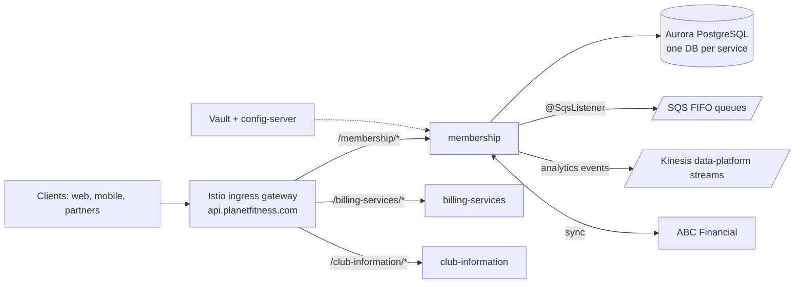

The backend (the "PFX platform") is a fleet of **Java 21 / Spring Boot 3.5** services built with Gradle, running on EKS with Istio, speaking REST at the edge and **SQS + Kinesis** for events.[^starter] For much of the member domain, **ABC Financial is the external system of record** — several services exist to sync with or proxy vendors like ABC and Zuora.[^membership]

## The services

The full, always-current inventory lives in [Backstage](https://backstage.planetfitness.com); routes are defined per service in the [api-gateway](https://github.com/planetfitness/api-gateway) repo. The core domain services:

| Service | Owns |
| --- | --- |
| membership | System of record for membership records (synced from ABC Financial): lifecycle (create, revise, freeze, cancel, transfer, up/downgrade), agreements, digital memberships, High School Summer Pass |
| member-services / member-experience | Member-facing APIs behind web and mobile |
| billing-services / payment-services / financial-management-service | Billing and payments — Zuora integration via the `billing-zra-proxy` / `payment-zra-proxy` services |
| club-information / club-management | Club data and administration |
| join / pfx-join | The online join flow (runs in PCI-segregated CDE environments) |
| offers / loyalty / activities / guest-service / identity | Offers, referral codes, fitness activities, guest flows (Black Card Guest, Day Guest Registration), identity |
| pfx-constellation-* | Constellation program: router, gatekeeper, horizon-orchestrator, observation-service |
| pfx-abc-connector-service / pos-proxy / platform-integration-service | Vendor connectors (ABC Financial, POS, external vendors) |

## The platform

- **API gateway = Istio ingress gateway** (Envoy), not a separate product. Public gateway at `api.planetfitness.com`, internal at `api.internal.planetfitness.com`, with `api.cde.*` variants for the PCI scope. Each service gets a `VirtualService` mapping its path prefix to its in-cluster service (`/membership/` → `membership.default.svc.cluster.local`).[^gateway]
- **Auth**: services are OAuth2 resource servers validating Auth0 JWTs; service-to-service calls use Auth0 M2M client-credentials.
- **Config and secrets**: Spring Cloud Config via the shared `config-server`; secrets from **HashiCorp Vault** with Kubernetes auth, including dynamically leased AWS credentials.
- **Shared libraries**: `pfx-platform-bom` pins versions; `pfx-web`, `pfx-rds`, `pfx-aws-integration`, `sqs-messaging`, `kinesis-event-publishing`, `platform-openapi` — resolved from a private S3 Maven repo.

## Data & events

- **One service, one database.** Relational services run **Aurora PostgreSQL 16** (master + read-replica endpoints, Flyway migrations); others use **DynamoDB single-table design** (the starter's default). A service can use both — membership keeps balances in DynamoDB alongside its Aurora cluster.
- **Inbound events: SQS** — FIFO queues per operation (`MembershipCreateQueue.fifo`, `MembershipScheduleFreezeQueue.fifo`, …) consumed with `@SqsListener` via the `sqs-messaging` lib. DLQs have reprocessing scripts in the runbooks repo.
- **Outbound analytics: Kinesis** — snake_case data-platform streams (`account_management_events`, `acquisition_events`, `in_club_events`, …) via `kinesis-event-publishing`.
- There is **no Kafka**.[^membership]

## API conventions

REST with **code-first OpenAPI**: springdoc generates the spec from annotations, and CI publishes it to the shared `api-collections` repo. Cross-service contracts are verified with **Pact** against the in-cluster `pfx-pact-broker`.

## Quality gates

JUnit 5 with Testcontainers/LocalStack for integration tests, RestAssured for acceptance, Gatling for performance — and **PIT mutation testing with an enforced 80% mutation threshold** (see [How do we test our code?](/shipping/testing/)). CircleCI builds on the `planetfitness/infrastructure` orb with Veracode scans; images are `ibm-semeru` JRE 21 with the Datadog Java agent baked in; deploys go test → nonprod → prod behind manual approvals, with HPAs per service (membership runs 15–60 pods in prod).[^starter]

## Starting a new service

Create a repo from the [hybrid-service-starter](https://github.com/planetfitness/hybrid-service-starter) template — Spring Boot 3.5, hybrid REST + SQS, DynamoDB single-table, LocalStack for local dev. There's no scaffold CLI: it's clone-and-rename per the starter README, then coordinate with the DI team to provision Auth0/SQS/DynamoDB and with SRE for monitors. Nine times out of ten, though, your feature belongs in an existing domain service.

## Further reading

- [Legacy PFX architecture diagram](https://planetfitness.atlassian.net/wiki/spaces/PFX/pages/69566465) (Confluence: PFX-Platform Services)
- [Dynamic configuration / config-server usage](https://planetfitness.atlassian.net/wiki/spaces/PFX/pages/3846733866) — how service feature flags flow through `config-server`
- [ABC API documentation](https://abcfinancial.3scale.net/docs/) — the external system of record's API
- [Bill on Join: code-level analysis](https://planetfitness.atlassian.net/wiki/spaces/PC1/pages/5250940937) — deep dive into the member-lifecycle billing change

[^starter]: [hybrid-service-starter](https://github.com/planetfitness/hybrid-service-starter) and [membership `build.gradle`](https://github.com/planetfitness/membership) — Java 21, Spring Boot 3.5, Gradle, PIT `mutationThreshold = 80`, `ibm-semeru` JRE 21 image.
[^membership]: [membership](https://github.com/planetfitness/membership) — Aurora PostgreSQL 16 + DynamoDB, SQS FIFO queues (`@SqsListener`), Kinesis data-platform streams, ABC Financial sync. No Kafka dependency in `pfx-platform-bom`.
[^gateway]: [api-gateway](https://github.com/planetfitness/api-gateway) — Istio ingress `Gateway` + per-service `VirtualService` route mappings; full inventory in [Backstage](https://backstage.planetfitness.com).
