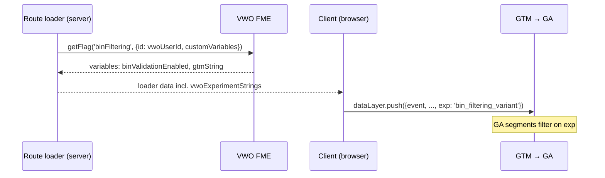

Experiments run on **VWO FME** (Feature Management & Experimentation), evaluated **server-side** in the React Router apps. Analysis happens in **Google Analytics**: every experiment variation carries a `gtmString`, and enabled experiments are stamped onto dataLayer events as the **`exp`** field, which GTM forwards to GA. If the `exp` plumbing isn't wired, your test runs blind.

VWO is **only** for experiments — standard feature toggles use [our own pipeline-driven plumbing](/runbooks/feature-flags/) instead (full-VWO flagging turned out to be cost-prohibitive).

## How assignment works

- The VWO client is initialized once per app in `app/middleware/vwoClient.ts` (`vwo-fme-node-sdk`; env: `IS_VWO_ENABLED`, `VWO_FME_ACCOUNT_ID`, `VWO_FME_SDK_KEY`; 60s flag polling).
- Each experiment is a module in `app/experiments/<name>/` with a `.server.ts` that calls `getFlag('<flagKey>', { id: vwoUserId, customVariables })`. The user id comes from `getVwoUserId(request)` (cookie-based), so assignment is stable per visitor.
- **Convention: every VWO variation defines two kinds of variables** — the behavior switch(es) the code reads (e.g. `binValidationEnabled`), and a **`gtmString`** naming the variation for analytics (e.g. `bin_filtering_control` / `bin_filtering_variant`).
- Gotcha: array `customVariables` must be `JSON.stringify`-ed before being sent to VWO (see `saleCampaignIDs` in any experiment module).

## How the GA link works

1. The route loader collects the `gtmString` of every **enabled** flag into `vwoExperimentStrings` and returns it comma-joined (`.toString()`).
2. Client-side effects push dataLayer events — `virtualPageview`, `ecomCheckout`, `customEvent`, and error events — spreading `...(vwoExperimentStrings && { exp: vwoExperimentStrings })` onto each one.
3. GTM (bootstrapped in `app/root.tsx`) forwards the events to GA, where `exp` is available for segments and audiences.

:::caution
`exp` is **comma-joined across overlapping experiments** — a user in two tests produces `exp: "annual_fee_19_variant,bin_filtering_variant"`. GA segments must match on **contains**, never exact-equals, or you'll silently exclude everyone who's enrolled in more than one experiment.
:::

## How-to: stand up a test end to end

1. **In VWO**: create the FME flag with your variations. In *each* variation, set the behavior variable(s) and a `gtmString` following the `<experiment>_control` / `<experiment>_variant` convention.
2. **In the app**: add `app/experiments/<name>/<name>.server.ts` exposing a `getVWO<Name>Data(vwoFmeInstance, context)` helper that reads the flag's variables (copy an existing module — `binFiltering` is a clean template, including the fallback to a static feature toggle for non-enrolled users).
3. **In the route loader**: call your helper and push its `gtmString` into `vwoExperimentStrings` when the flag is enabled.
4. **Verify the plumbing**: run locally, open the console, and check `window.dataLayer` — your `gtmString` must appear as `exp` on the pageview *and* the custom events. There are unit tests asserting exactly this (see `binFiltering dataLayer exp` in `join-payment/route.test.tsx`) — add the same for your route.
5. **In GA**: build one segment per variation on the `exp` field (contains-match), and confirm exposure counts roughly match VWO's assignment numbers before trusting any readout.

## Worked example: BIN Filtering

The `binFiltering` flag (JOINREVAMP-1297) A/B tests BIN validation on the join payment step:

- Variables per variation: `binValidationEnabled` (drives the behavior) and `gtmString` (`bin_filtering_control` | `bin_filtering_variant`).
- Users not enrolled in the experiment fall back to the static `bin-validation-enabled` feature toggle — the decision logic lives in `getBinValidationDecision`.
- The payment route stamps `exp` onto `virtualPageview`, `ecomCheckout`, `customEvent`, **and** `recurring_payment_submit_error` (with `error_message_type: 'BIN payment error'`) — so GA can compare not just conversion but BIN-error rates between arms.

**GA segments to set up for this test**: two event-scoped segments, `exp` *contains* `bin_filtering_variant` and `exp` *contains* `bin_filtering_control`. Key comparisons: `ecomCheckout` completion rate per arm, and the rate of `recurring_payment_submit_error` events where `error_message_type` is `BIN payment error`. If `exp` isn't yet registered as a custom dimension in the GA property, that's step zero — segments can't see it otherwise.
