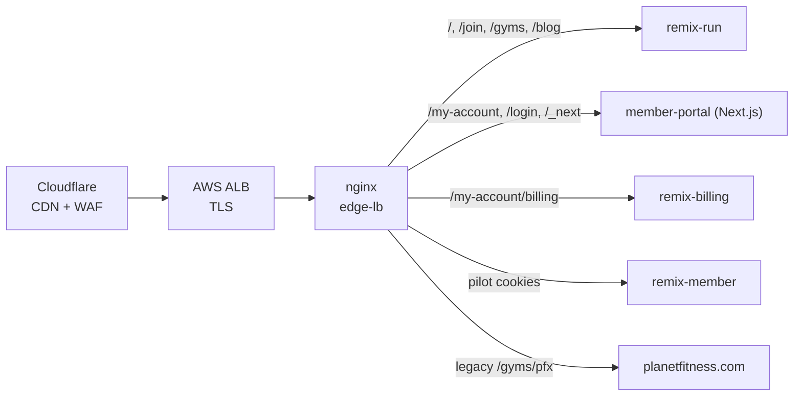

One domain, three web apps from three different generations, stitched together path-by-path by an nginx edge layer. Everything new goes in the **[remix-run](https://github.com/planetfitness/remix-run)** monorepo (React Router 7); the two older apps are being migrated out of, one route at a time.

## How we got here

From 2014 the site was a single Drupal platform. Partial migrations then stacked up without any of them finishing: a partner-led React rebuild of pf.com (2019, custom CSS lib), a Next.js member portal (2021, Contentful + Material UI), and Remix for US/CA prospect pages and online join (2024, Tailwind). The Drupal Pod decommissioned Drupal in June 2025 — leaving today's three production repos, three design systems, and two overlapping Contentful spaces ("Workflow 2X" legacy and "Website"). That history, not intent, is why the architecture below looks the way it does.[^consolidation]

## The apps

| Repo | What it is | Stack |
| --- | --- | --- |
| [remix-run](https://github.com/planetfitness/remix-run) | The strategic frontend. One monorepo, four apps selected by `APP_NAME`: the public site and join flow (`remix-run`), in-club kiosk (`remix-kiosk`), billing portal (`remix-billing`), and member account (`remix-member`). | React Router 7 (framework mode), React 19, TypeScript strict, Vite, Tailwind, Express SSR |
| [member-portal](https://github.com/planetfitness/member-portal) | Despite the name, the monolithic Next.js app serving much of www — `/my-account`, `/login`, careers, guest registration, and ~50 legal/marketing pages. Absorbed the earlier Gatsby site. | Next.js 15 (Pages Router, custom server), React 18, JavaScript (no TS), styled-components + `@planetfitness/pf-ui` |
| [planetfitness.com](https://github.com/planetfitness/planetfitness.com) | The original site (`pf-website`): club pages under `/gyms`, offers, and the legacy checkout. Also exports the shared server-rendered header/footer as microfrontends that other apps embed. | CRA + hand-rolled Express SSR, React 16, Redux + sagas, `@planetfitness/pf-ui` |
| [edge-lb](https://github.com/planetfitness/edge-lb) | The nginx layer that makes the above look like one website (see below). | nginx on EC2 (ASG), Packer AMIs, Terraform |

Each row is drawn from the repo's own `package.json`, Dockerfile, and manifests.[^repos]

## How it's stitched together

Traffic flows **Cloudflare (CDN/WAF) → AWS ALB (TLS) → nginx `edge-lb` → apps**. nginx maps path prefixes to apps, which is how three codebases share `www.planetfitness.com`:



- `/`, `/join`, `/gyms`, `/blog`, and most marketing pages → **remix-run**
- `/my-account`, `/login`, `/careers`, `/_next`, `/api` → **member-portal**
- `/my-account/billing` → **remix-billing**
- Unmatched routes fall back: member-portal → legacy Drupal redirect map → Remix 404

Migration is incremental and reversible: `split_clients` percentages and pilot cookies (`isPilot`, `isPilotTransfer`) canary individual account routes from member-portal to `remix-member` before they move for good. The edge also serves the per-country domains (`.ca`, `.mx`, `.pa`, `.do`, `.com.au`, Spain) and the kiosk domain. **When you need to know which app owns a URL, the nginx config in `edge-lb` is the source of truth.**[^edgelb]

## Server-first data (the BFF pattern)

The React Router apps are also our backend-for-frontend: loaders and actions call PFX microservices server-side from `app/models/*.server.ts`, with service URLs injected per app and environment via `PFX_*` env vars (`https://api.internal.planetfitness.com/<service>`). Code in `*.server.ts` files never ships to the client — member data stays on the server, client state is for UI.

## Shared across all three apps

Contentful (CMS), Auth0 (login), Mapbox (club finder), VWO (experiments only — [standard toggles ride the pipeline](/runbooks/feature-flags/)), Datadog (`dd-trace`), npm with the private `@planetfitness` GitHub Packages registry, CircleCI (`planetfitness/infrastructure` orb) with Veracode scanning, and Docker → EKS + Istio in `us-east-1`, defined in Terraform. Nonprod is `staging.planetfitness.com` / `pfx-nonprod.com`; the join/payment path runs in PCI-segregated `cde-*` environments.

## Conventions that matter (in the monorepo)

- **TypeScript strict mode.** New frontend code goes in `remix-run`, and it's strict TS. (The older apps are plain JS — one more reason to migrate.)
- **Server-first data.** Loaders/actions and `*.server.ts` models; no client-side data layer.
- **Tailwind + in-repo components**, documented in Storybook with Chromatic. The older apps use `@planetfitness/pf-ui` + styled-components.
- **Tests:** Vitest for units (colocated `*.test.tsx`), Playwright for functional tests (MSW-mocked backends) and e2e against staging.

```sh
# run any of the four apps locally
npm ci
npm run dev                 # main app (remix-run)
npm run dev:remix-member    # or remix-kiosk / remix-billing
npm run dev:mocks           # MSW-mocked backends, no VPN needed
```

:::note
Naming gotcha: the **member-portal** repo is the Next.js app that serves much of www — including marketing pages — while the **planetfitness.com** repo only serves `/gyms` and legacy surfaces. Don't let the repo names steer you; check `edge-lb`.
:::

## Where it's going

There's an active consolidation proposal (David O'Shaughnessy / Rob Callahan, Sep 2025: *Website Consolidation*)[^consolidation] to finish what the partial migrations never did: collapse pf.com and member-portal into the Remix apps, keep Cloudflare + edge-lb but point everything at Remix, serve all content from the single Contentful "Website" space, and route auth through `remix-member`. Highlights:

- **Path-by-path migration tables** exist for both legacy apps (e.g. `/login` → alias to `/signin` on `remix-member`; guest flows → `remix-join`; `/gyms/pfx/*` internals → removed). The pilot cookies on `/my-account/profile` are the first of these plays in flight.
- **CMS**: dynamic-page rendering from Contentful in Remix is built and waiting on review ([remix-run#2666](https://github.com/planetfitness/remix-run/pull/2666)); the deck also floats a code-first alternative (content in the repo + AI translations) since there's no dedicated content manager today.
- **Mexico & Panama** (still on the older stacks) follow once .com/.ca consolidate — same Remix pattern, `es-MX`/`es-PA` locales, with joins/auth via third-party POS vendors.
- Open questions the deck itself raises: whether four separate Remix apps (and four pipelines) are worth the complexity, and whether Tailwind-without-a-component-library can hold up theming and accessibility at scale.

:::caution
The consolidation is a proposal, not a done deal — treat the migration tables as direction, and the `edge-lb` nginx config as the source of truth for what's live today.
:::

[^repos]: [remix-run](https://github.com/planetfitness/remix-run), [member-portal](https://github.com/planetfitness/member-portal), [planetfitness.com](https://github.com/planetfitness/planetfitness.com) — `package.json`, Dockerfiles, and `manifests/`.
[^edgelb]: [edge-lb](https://github.com/planetfitness/edge-lb) — nginx `planetfitness.com.conf` path→upstream mappings, `split_clients` and `isPilot*` cookie routing.
[^consolidation]: *Website Consolidation* proposal, D. O'Shaughnessy & R. Callahan, Sep 2025 (internal presentation). <!-- TODO: replace with Confluence/SharePoint URL once provided --> Live link pending.
